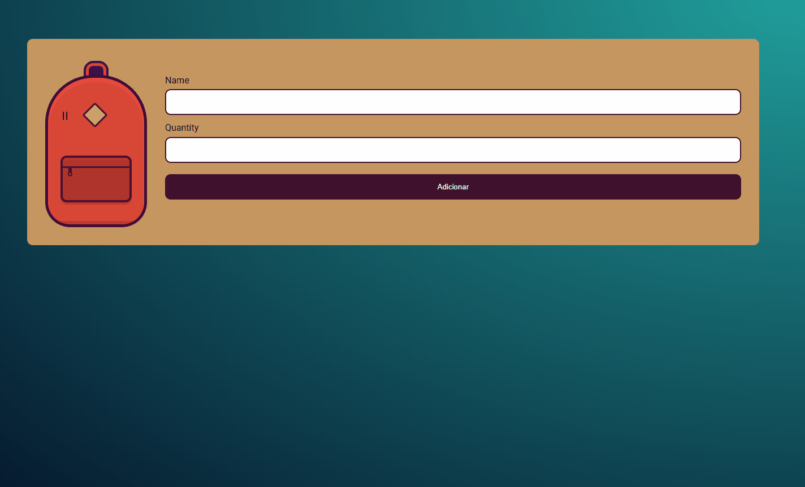

# Mochila de Viagem

  Projeto desenvolvido durante o curso JavaScript na Web: armazenando dados no navegador da Alura.

  Foi usado o LocalStorage do navegador para armazenar os dados.

## Tecnologias

- HTML
- CSS
- Javascript

## Deployment

Link para a página: 
<a href="https://guilhermerocha0.github.io/mochila-de-viagem/" target="_blank">Mochila de Viagem</a>

